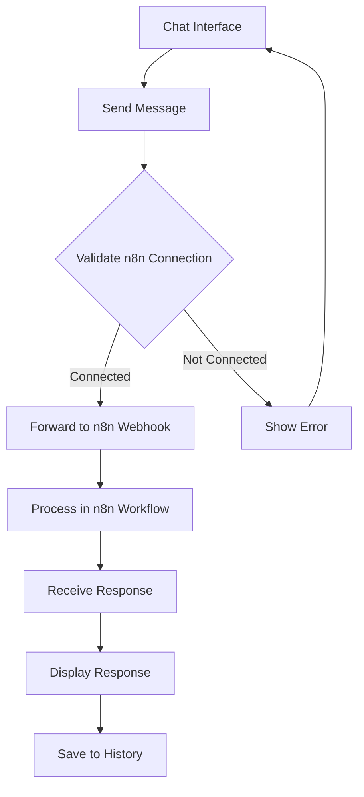

## 1. Product Overview
A modern AI chatbot application built with Laravel that connects to n8n workflows for intelligent responses. The chatbot features De Boer Marine's purple-themed dark mode design with a clean, professional interface for maritime industry users.

## 2. Core Features

### 2.1 User Roles
| Role | Registration Method | Core Permissions |
|------|---------------------|------------------|
| Guest User | No registration required | Can access chat interface and send messages |
| Authenticated User | Email registration | Can access chat history, save conversations |
| Admin | Admin panel creation | Can manage n8n connections, view analytics |

### 2.2 Feature Module
The AI chatbot consists of the following main pages:
1. **Chat Interface**: Main chat window with message input, conversation display, and typing indicators.
2. **Settings Page**: n8n webhook configuration, API key management, and chat preferences.
3. **History Page**: Conversation history with search and filter capabilities.

### 2.3 Page Details
| Page Name | Module Name | Feature description |
|-----------|-------------|---------------------|
| Chat Interface | Message Input | Send text messages with Enter key or send button, supports multiline input. |
| Chat Interface | Conversation Display | Show user and AI messages with timestamps, typing indicators, and scroll-to-bottom functionality. |
| Chat Interface | Connection Status | Display real-time connection status to n8n webhook with visual indicators. |
| Settings Page | n8n Configuration | Input and validate n8n webhook URL, test connection functionality. |
| Settings Page | API Management | Secure storage and display of API keys with encryption. |
| Settings Page | Chat Preferences | Customize response timeout, message limits, and display options. |
| History Page | Conversation List | Display chronological list of past conversations with preview text. |
| History Page | Search & Filter | Search conversations by keywords and filter by date range. |

## 3. Core Process
**User Flow:**
1. User accesses the chat interface
2. User types a message and sends it
3. System validates and forwards message to configured n8n webhook
4. n8n processes the request through its workflow
5. Response is received and displayed in the chat interface
6. Conversation is saved to history

## 4. User Interface Design

### 4.1 Design Style
- **Primary Color**: Deep purple (#6B46C1) - De Boer Marine brand color
- **Secondary Color**: Light purple (#9333EA) for accents and hover states
- **Background**: Dark gray (#1F2937) for main background
- **Surface Color**: Slightly lighter gray (#374151) for cards and containers
- **Text Color**: Light gray (#F3F4F6) for primary text, medium gray (#9CA3AF) for secondary
- **Button Style**: Rounded corners with purple gradient, subtle shadows on hover
- **Font**: Inter or similar modern sans-serif, 16px base size
- **Layout**: Card-based design with generous padding and smooth transitions

### 4.2 Page Design Overview
| Page Name | Module Name | UI Elements |
|-----------|-------------|-------------|
| Chat Interface | Message Container | Dark background with subtle border, rounded corners, max-width 800px, centered layout. |
| Chat Interface | Message Bubbles | User messages in purple (#6B46C1), AI responses in dark gray (#4B5563), both with 12px padding and 8px border-radius. |
| Chat Interface | Input Area | Fixed bottom position with purple border-top, textarea with auto-resize, send button with purple background. |
| Settings Page | Configuration Cards | Light gray cards (#374151) with purple headers, form inputs with dark backgrounds and purple focus borders. |
| History Page | Conversation Cards | Horizontal cards showing conversation preview, purple hover effect, date displayed in muted gray. |

### 4.3 Responsiveness
Desktop-first design with mobile adaptation. Chat interface adapts to full-width on mobile with touch-optimized input areas and larger touch targets for buttons.

### 4.4 3D Scene Guidance
Not applicable for this chatbot application.