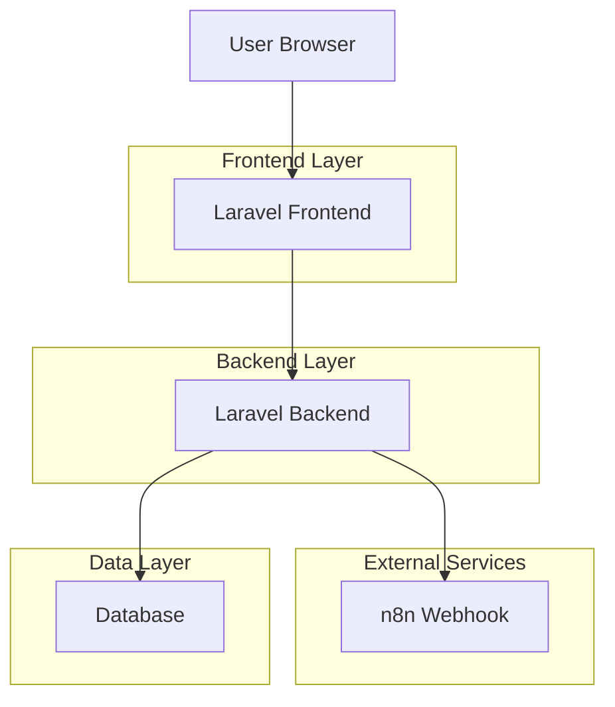
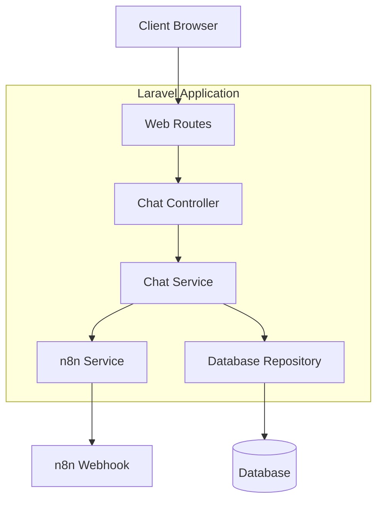
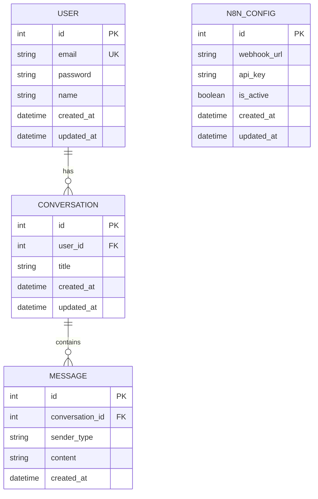

## 1. Architecture design



## 2. Technology Description
- Frontend: Laravel Blade + TailwindCSS + Alpine.js
- Backend: Laravel 10.x
- Database: MySQL/PostgreSQL
- Cache: Redis (optional)
- External Service: n8n Webhook API

## 3. Route definitions

| Route | Purpose |
|-------|---------|
| / | Chat interface homepage |
| /chat | Main chat interface |
| /settings | n8n configuration and preferences |
| /history | Conversation history |
| /api/chat/send | Send message to n8n webhook |
| /api/chat/history | Get conversation history |
| /api/settings/webhook | Update n8n webhook configuration |

## 4. API definitions

### 4.1 Core API

**Send Message to Chat**
```
POST /api/chat/send
```

Request:
| Param Name | Param Type | isRequired | Description |
|------------|------------|------------|-------------|
| message | string | true | User's message text |
| conversation_id | string | false | Existing conversation ID (optional) |

Response:
| Param Name | Param Type | Description |
|------------|-------------|-------------|
| success | boolean | Operation status |
| response | string | AI response from n8n |
| conversation_id | string | Conversation identifier |

Example:
```json
{
  "message": "What is the weather like?",
  "conversation_id": "550e8400-e29b-41d4-a716-446655440000"
}
```

**Get Conversation History**
```
GET /api/chat/history
```

Request:
| Param Name | Param Type | isRequired | Description |
|------------|------------|------------|-------------|
| page | integer | false | Page number (default: 1) |
| limit | integer | false | Items per page (default: 20) |

Response:
| Param Name | Param Type | Description |
|------------|-------------|-------------|
| conversations | array | Array of conversation objects |
| total | integer | Total conversation count |
| page | integer | Current page number |

## 5. Server architecture diagram



## 6. Data model

### 6.1 Data model definition



### 6.2 Data Definition Language

**Users Table**
```sql
CREATE TABLE users (
    id INT PRIMARY KEY AUTO_INCREMENT,
    email VARCHAR(255) UNIQUE NOT NULL,
    password VARCHAR(255) NOT NULL,
    name VARCHAR(100) NOT NULL,
    created_at TIMESTAMP DEFAULT CURRENT_TIMESTAMP,
    updated_at TIMESTAMP DEFAULT CURRENT_TIMESTAMP ON UPDATE CURRENT_TIMESTAMP
);
```

**Conversations Table**
```sql
CREATE TABLE conversations (
    id INT PRIMARY KEY AUTO_INCREMENT,
    user_id INT,
    title VARCHAR(255),
    created_at TIMESTAMP DEFAULT CURRENT_TIMESTAMP,
    updated_at TIMESTAMP DEFAULT CURRENT_TIMESTAMP ON UPDATE CURRENT_TIMESTAMP,
    FOREIGN KEY (user_id) REFERENCES users(id) ON DELETE CASCADE
);
```

**Messages Table**
```sql
CREATE TABLE messages (
    id INT PRIMARY KEY AUTO_INCREMENT,
    conversation_id INT,
    sender_type ENUM('user', 'ai') NOT NULL,
    content TEXT NOT NULL,
    created_at TIMESTAMP DEFAULT CURRENT_TIMESTAMP,
    FOREIGN KEY (conversation_id) REFERENCES conversations(id) ON DELETE CASCADE
);
```

**n8n Configuration Table**
```sql
CREATE TABLE n8n_configs (
    id INT PRIMARY KEY AUTO_INCREMENT,
    webhook_url VARCHAR(500) NOT NULL,
    api_key VARCHAR(255),
    is_active BOOLEAN DEFAULT true,
    created_at TIMESTAMP DEFAULT CURRENT_TIMESTAMP,
    updated_at TIMESTAMP DEFAULT CURRENT_TIMESTAMP ON UPDATE CURRENT_TIMESTAMP
);
```

**Indexes for Performance**
```sql
CREATE INDEX idx_conversations_user_id ON conversations(user_id);
CREATE INDEX idx_messages_conversation_id ON messages(conversation_id);
CREATE INDEX idx_messages_created_at ON messages(created_at);
```